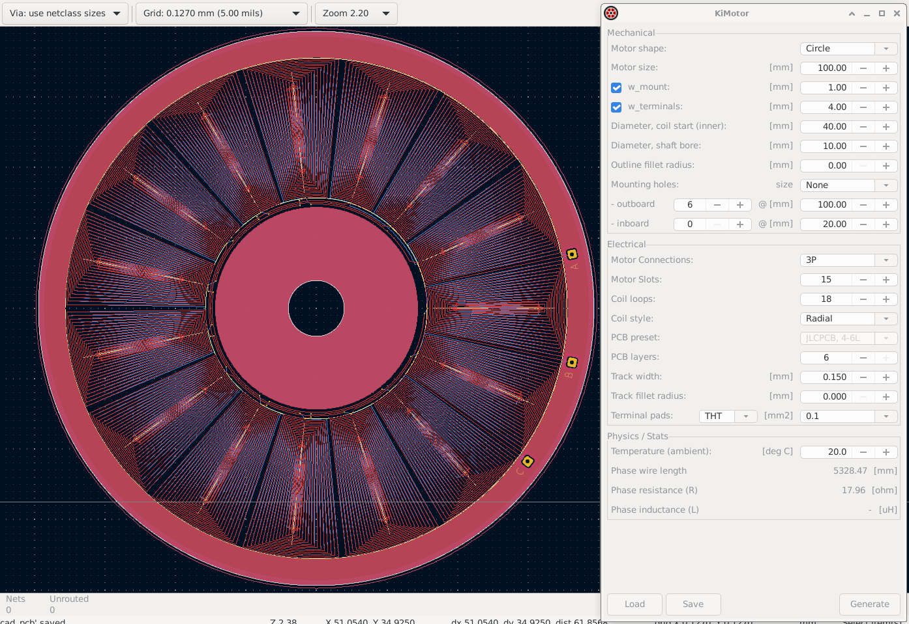
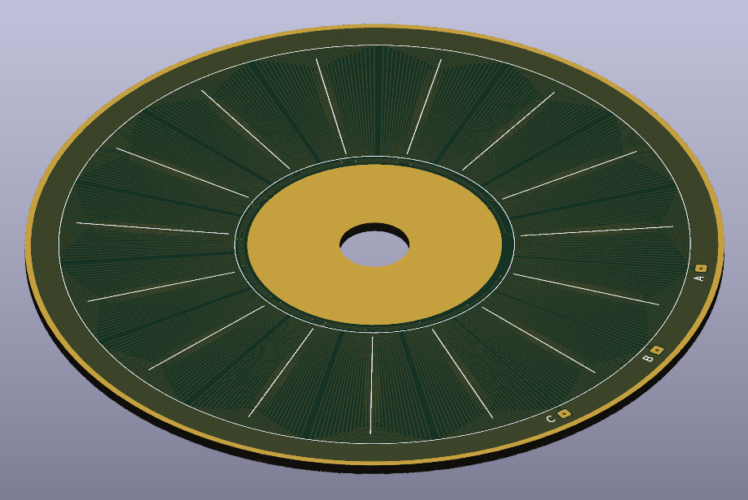
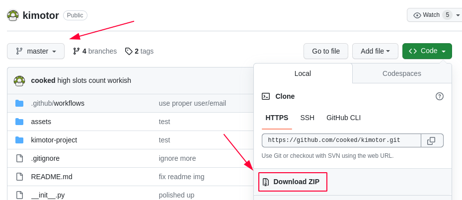
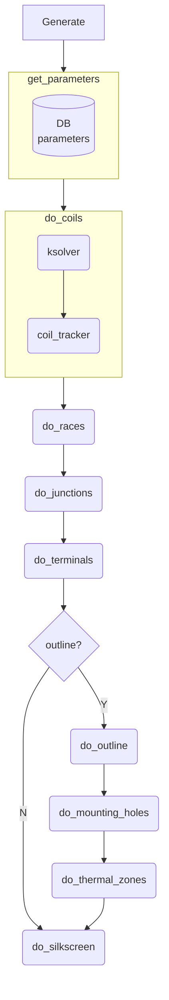

# KiMotor  

KiMotor is a [KiCad EDA](https://www.kicad.org/) plugin that automates the design of parametric PCB motors.





## Requirements

KiMotor requires [NumPy](https://numpy.org/) for all the math involved in the generation of the layouts.

```bash
# Linux - KiCad uses the system Python so, from the console, just run:
pip3 install numpy

# Mac - KiCad ships with its own Python so NumPy must be installed there:
cd /Applications/KiCad/KiCad.app/Contents/Frameworks/Python.framework/Versions/3.9
./pip3 install numpy
```


## Installation

### Manual, with Git clone

This is the preferred installation method. Cloning the repo allows you to manually pull in updates later on, as they become available.

Depending on your platform, you have to make sure the plugin is placed in the folder where KiCad expects it to be (see the plugins search paths [KiCad documentation](https://dev-docs.kicad.org/en/apis-and-binding/pcbnew/)):

```bash
# Linux (KiCad from Ubuntu PPA)
# TODO
# Linux (KiCad 7 from FlatPak)
cd <HOME>/.var/app/org.kicad.KiCad/data/kicad/7.0/3rdparty/plugins
# Windows
cd C:\Users\<USERNAME>\Documents\KiCad\7.0\3rdparty\plugins
# Mac 
cd <HOME>/Documents/KiCad/7.0/3rdparty/plugins

# then clone the repo
git clone https://github.com/cooked/kimotor.git
```

### Manual, via repo archive

Similar to the previous method but, instead of cloning the repo, download it as a zip archive and unpack it in the proper folder (described above).




### Automated, via package manager

While a Kimotor version do exist in the official KiCad plugin repository, it has since 
fallen behind the development and is not recommended. 
Stick to one ofthe manual installation methods listed above, until next official release.

## Troubleshooting

Sometimes it is hard to troubleshoot problems with the plugin.
If there is an error preventing the plugin to load at all (no KiMotor icon in the toolbar), like in the case of missing Python packages, it is possible to [get a backtrace from the KiCad Scripting Console](https://forum.kicad.info/t/getting-started-using-python-scripts/14765/2) with the following commands:

```python
import pcbnew
print pcbnew.GetWizardsBackTrace()
```

If the KiMotor plugin does load, but fails to generate a PCB layout because of a bug, it is still possible to get a popup with the error message, as long as the KiCad Scripting Console was open in the background before running the plugin.

## Developers

### Code flow



